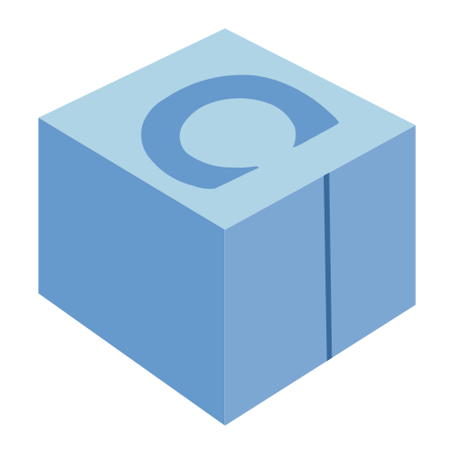

<h1 align="center">🥐 42Paris Student 👋</h1>

- 🔭 I’m currently doing my internship at [SBG-Systems](https://www.sbg-systems.com/)

- 💫 I'm also developping tiny [video-games](https://github.com/aautin/putt-it) from scratch in my spare time

- 🌱 I want to specialize in 🛡️ **CyberSecurity**, 🎮 **Game Development** and 🛠️ **GUI Software Development**

<h3 align="left">Languages and Tools:</h3>

  
  
  
  
  
  
  
  
  
  
  
  
  

